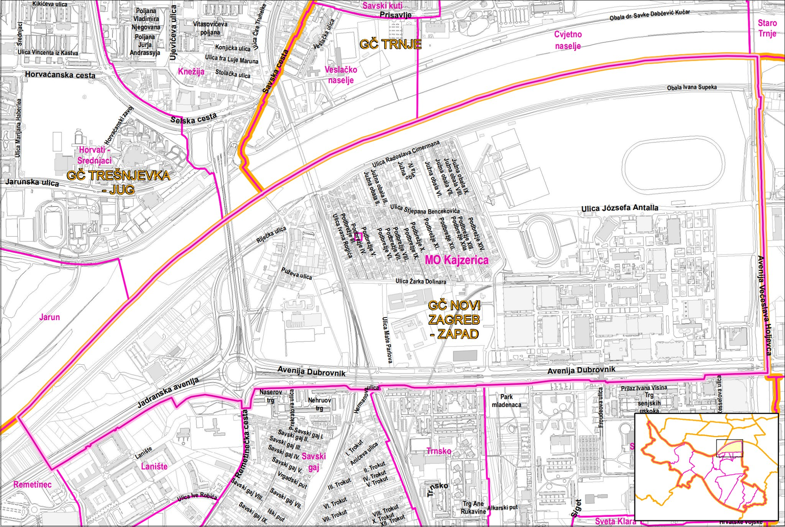

Bilješke i korisne informacije vezane za gradsku četvrt - Novi Zagreb zapad - Zagrebačko gradsko naselje - [Kajzerica](https://hr.wikipedia.org/wiki/Kajzerica)

Ažurirano, 17.6.2019.

# Prostor
Prostor Kajzerice je omeđen s:
 * S sjeverne strane - uključuje nasip i travu i sve do polovice rijeke Save
 * S istočne strane - uključuje INA zgradu, do pola raskršća i cijeli most slobode
 * S južne strane - uključuje cijelu jadransku aveniju, cijeli rotor i cijelu av.dubrovnik uključujući dio za pješake i drvored netom ispred zgrada u Trnskom
 * S zapadne strane - uključuje (novu) cestu prema Laništu / Arena centru
Pod sve spomenuto spada i cijeli Hipodrom, Zagrebački Velesajam, INA zgrada, rotor, Jysk/Spar/mcdonalds, nasip, mostovi Jadranski, pješački plavi, zeleni/hendrix željeznički i most slobode....

# Komunalno
## Odvoz smeća
Zagrebački Holding - podružnica Čistoća radi redovni odvoz za kućanstva prema rasporedu:
* mješani otpad - svaki utorak i petak
* plastična ambalaža - svaki 2.i 4. petak u mjesecu
* biootpad - svaki utorak

# Zdravlje
## Patronažna zdravstvena zaštita
Za područje Kajzerica, Savskog gaja i sl. patronažnu osigurava
Rosandić Mirjana, bacc.med.techn.
Adresa: Podbrežje IV. 5
Tel: +385 (1) 6557228
Dom Zdravlja Zagreb Centar

Radno vrijeme
Savjeti od 7:30 - 9:30
Rad na terenu od 9:30 

## Zdravstvenom zaštita djece
Na kajzerici nema pedijatrije
